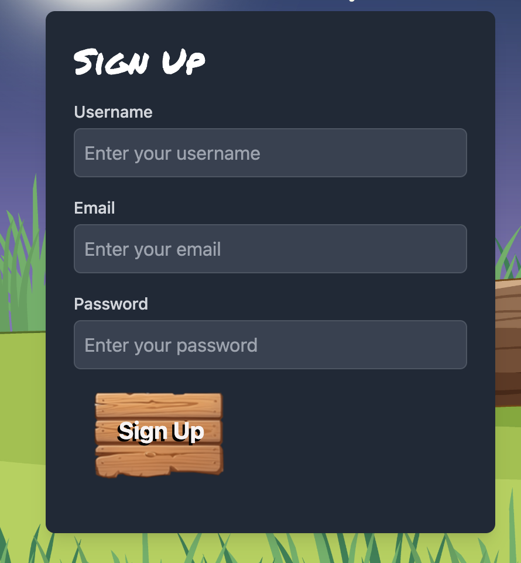
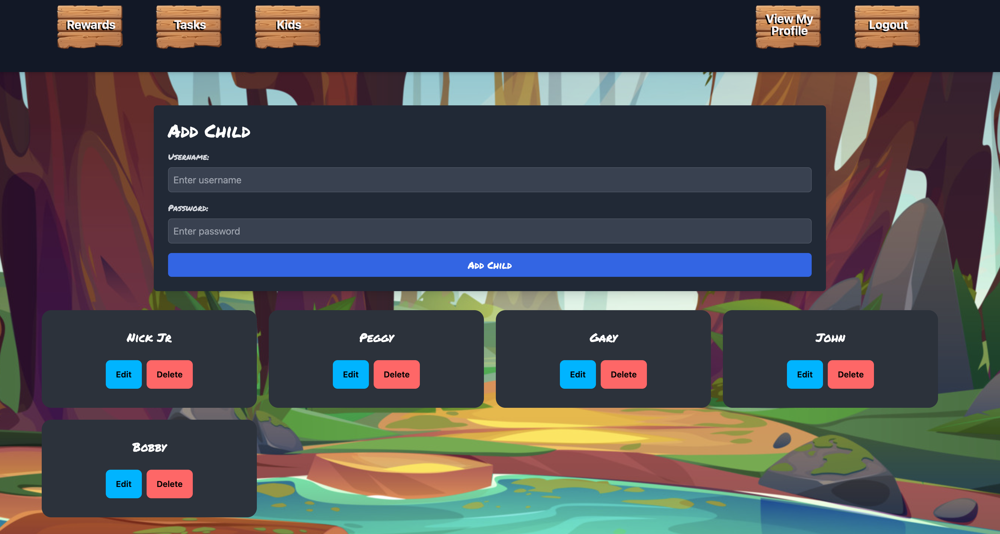
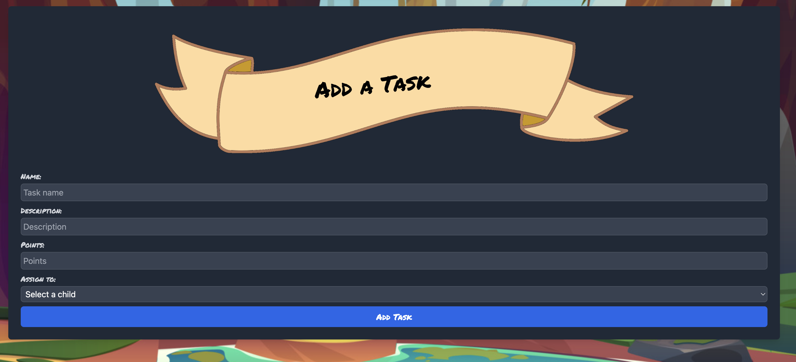
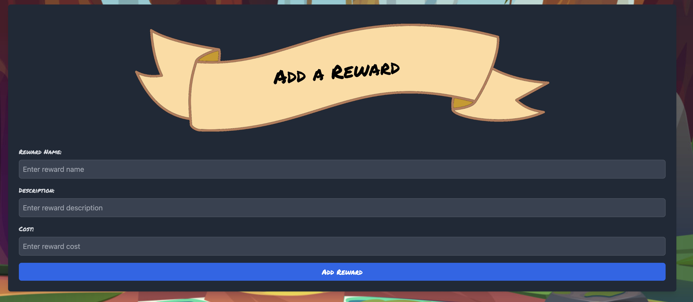

# Quester
Rewards for Tasks!

## Description
  *  Use React to build a fun kid friendly app to complete tasks and buy rewards with points.
  *  Parents control the flow of the whole app!
  *  Kids reap the rewards by doing everyday tasks!
  *  Authentication every step of the way so cheating isn't happening.

  
  ## Table of Contents
  * [Installation](#installation)
  * [Usage](#usage)
  * [Contributing](#contribution)
  * [Questions](#questions)
  * [Obstacles](#obstacles-and-successes)
  
  ## Installation

  * The app is up and running on Render at 

  https://quester-407s.onrender.com
  
  * If you are granted access to clone or fork the repo navigate to your desktop in your terminal to clone it down. 

  * Make sure to run npm install in all directories with packages.
  
  ## Usage
  * Internet required. 
  * If opening from a terminal and using a localhost host type npm run dev in your terminal at the root of the directory. 

  Flow of the app is as follows:
  * Create an account from View My Profile
  

  * Add kids to your account
  
  * Add a task for your kids
  
  * Add a reward for your kids
  

  * Now the kids will be able to login under their account to view tasks, rewards and after redeeming tasks, spend points in the shop!
  
  

  ## Contributing
  No contributions please. 

  ## License
   

This project is unlicensed. 

  
  ## Questions
  * Here is a link to Nick's [GitHub](https://github.com/soko77788) profile.
   * Here is a link to Caleb's [GitHub](https://github.com/AranosBanazir) profile.
   * Here is a link to Larry's [GitHub](https://github.com/LerieLogin) profile.
  * For further questions email me at nicksokolowskidev7@gmail.com.

  ## Tools and 3rd party assistance
  * Built with React, MongoDb, Express, Node, Apollo, Graphql, Tailwind, DaisyUi
  * Images generated from canva.com 

  ## Obstacles and Successes
  * Creating a React app using technologies a couple of us weren't versed in.
  * Creating a seemless Authentication app that checks if the parent or child is logged in and displays a page based on the user.
  * Getting tasks and rewards to display on both pages and updating the database when one side of the equation was redeemed. 

 
  * Successes were that we thought of the app quickly even if we didn't know how to do it and created wireframes to get a visual of what to build

  * Nifty navigation setup to again check who is viewing and routing to the correct page. 

  * Caleb provided all of the backend data handling Schema, Seeds, TypeDefs, Resolvers, Mutations etc and excelled at it. 

  * Creating components went smooth throughout the process and adding polish and animations made the app come to life. 

  ## Deployed App

https://quester-407s.onrender.com
  